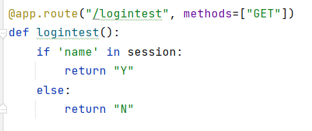

# 接口文档

本系统分为两个后端和一个安卓端，其中后端之前都是flask

## 1. 系统调用函数介绍

### 1.1 SHE算法（已有java实现）
  系统使用的同态加密算法，分为初始化，加密，解密和公钥产生函数。    

  初始化函数：  
    

  加密函数：  
      

  解密函数：  
      

  公钥产生函数：  
    
  
  
### 1.2 PointInRectangle算法

  算法功能为给定一个区域坐标点顺时针或逆时针方向集合和一个待判断的点坐标，  
  根据向量角度算法判断点是否在给定的点集合内。

  此算法分为两个部分，一个是直接在明文下进行判断，另一个是在密文下进行判断。 

  明文下算法：  

  

  密文下算法（和明文差不多，没实现成单独的函数）：

    

  （其中place_send_to_decrypt函数是解密并判断大小函数，此函数需要进行网络操作）  
   place_send_to_decrypt函数：  
     

### 1.3 四叉树算法  

  算法功能是给定一个矩形区域的坐标范围和一个在其上的点坐标，将该矩形区域划分为n层四叉树节点。  

  判断给定的点在最后一层的哪个子叶节点上，返回其位置。   

    

    
## 2 server：防疫组织服务器端接口  
（8080端口）

### 2.1 logintest: 测试是否登录  
     

### 2.2 login：登录接口
  
此接口需要调用数据库，查找数据库中用户的用户名和密码哈希，判断密码哈希是否相等。

    

### 2.3 register: 注册接口  
  
此接口用于注册用户名和密码，并返回唯一的UUID。

  

### 2.4 api：解密判断接口  
  此接口针对发来的密文数据组进行解密，并且判断是否都满足前者小于后者，如果都满足，返回1，否则返回0。  

  

### 2.5 placeapi：解密判断接口  

  （用于圈定位置查询，与2.4有些许不同）
  
  

### 2.6 pubkey：公钥产生接口  

  用于产生公钥，分发给安卓端用户。

  

### 2.7 status: 用户状态查询接口  

  用于安卓端查询用户状态。  

 

### 2.8 tree： 四叉树位置解密打乱接口  

  用于将发来的加密四叉树节点位置解密，同时返回乱序版节点对应的混乱四叉树节点位置。  

  

### 2.9 idsearch：功能一的实现接口  

  主要用于功能一的实现，即首先接收来自前端发来的查询请求，
  然后发送需要查询的用户uuid给云服务器，让云服务进行查询，并返回结果。  

  

### 2.10 placesearch：功能二的实现接口  

  此处首先对前端数据（顺时针或逆时针的区域点集）进行处理，然后判断该片区域涉及的四叉树区域节点。
  再将给定的点击坐标取负后加密，然后将打乱后的四叉树区域节点和加密后的坐标数据发送给云服务器进行查询，并返回结果。

  
  

### 2.11 relaseach：功能三的实现接口  

   此处直接将前台发来的数据发给了云服务器进行查询。

### 2.12 show：展示页面实现路由

    

  
## 3 server_cloud：云服务器端
8081端口

### 3.1 api：接收用户上传数据  

   此接口用来处理安卓上传的数据，储存用户数据。
   此处有个矛盾，就是存储数据不能作为演示数据。因为演示的数据都是实现处理好的。

### 3.2 idsearch：功能一实现接口 

   调用函数pandas_new_search_id实现功能一。

  

   pandas_new_search_id函数：  
   
   此处读取文件中的数据（没用数据库存，因为可能比较麻烦），
   利用pandas处理数据，根据现有数据计算，判断结果。  

  
  
  

### 3.3 placesearch：功能二实现接口

   调用函数place_search函数实现功能二。

  

   place_search函数：  

   功能实现大致同上一个函数。
   

### 3.4 relasearch：功能三实现接口  

   调用search_relationships函数实现功能三。  

  

   search_relationships函数：  

## 4 安卓端

  此部分基本上还好，可以沿用之前的app，改改端口就可以了。

 

  
